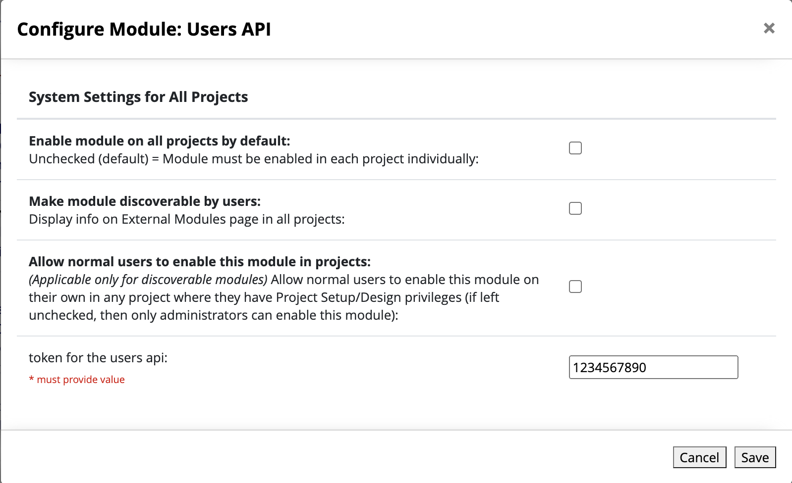

# Users API

## API Endpoint

Because of limitations on how we can extend the REDCap API through external modules, all API requests for the Users API go through the same endpoint.

```
POST /api/?type=module&prefix=users_api&page=service&NOAUTH
```
| Query String Parameter    | Description | Value | Required |
|--------------|-----------|------------|------------|
| type | Specifies the type of API being used.  The value of module means we are using an external module's API.|module| TRUE |
| prefix      |Specifies which external module's API we're using.  The value must be users_api to specify the Users API external module.|users_api| TRUE |
|page|Specifies which php file in the external module will handle the incoming request.  The request handler in the Users API external module is service.php|service	| TRUE|
|NOAUTH|If this query string parameter is present, then REDCap will not apply its standard API authentication to the request|(no value)|TRUE|

## Authentication

The Users API External Module uses a shared secret for authentication as well as an optional IP Whitelist/CIDR check.  Each request needs to contain the Users API token in its request body.  The request's token will be compared against the token configured in the external module's system settings.



## Requests

### Get User Details
This request queries the redcap_user_information  table and returns all non-sensitive data for a given username.


#### Request Body Parameters
|Parameter|Description|Required Value|
|---------|-----------|--------------|
|token|The shared secret used to authenticate the API request	||
|request|Specifies the API request type	|userdetail|
|username|REDCap username to use in SQL query	||

### Set User Suspension
Checks the time in the call for a valid syntax and updates user_suspended_time to the time passed by the call.

#### Request Body Parameters
|Parameter|Description|Required Value|
|---------|-----------|--------------|
|token|The shared secret used to authenticate the API request	||
|request|Specifies the API request type	|setsuspension|
|username|REDCap username to use in SQL query	||
|time|The time that the user should be suspended.  Must be in YYYY-MM-DD hh:mm:ss format.	||

### Suspend User
Suspends the user as of the time of the call to this method by setting user_suspended_time to the current server time.

#### Request Body Parameters
|Parameter|Description|Required Value|
|---------|-----------|--------------|
|token|The shared secret used to authenticate the API request	||
|request|Specifies the API request type	|suspend|
|username|REDCap username to use in SQL query	||

### Remove User Suspension
Unsuspends the user by setting user_suspended_time to null.

#### Request Body Parameters
|Parameter|Description|Required Value|
|---------|-----------|--------------|
|token|The shared secret used to authenticate the API request	||
|request|Specifies the API request type	|removesuspension|
|username|REDCap username to use in SQL query	||

### Set User Expiration
Checks the datetime in the call for a valid syntax and updates user_expiration to the time passed by the call.

#### Request Body Parameters
|Parameter|Description|Required Value|
|---------|-----------|--------------|
|token|The shared secret used to authenticate the API request	||
|request|Specifies the API request type	|setexpiration|
|username|REDCap username to use in SQL query	||
|time|The time that the user should be expired.  Must be in YYYY-MM-DD hh:mm:ss format.	||

### Expire User
Suspends the user as of the time of the call to this method by setting user_expiration to the current server time.

#### Request Body Parameters
|Parameter|Description|Required Value|
|---------|-----------|--------------|
|token|The shared secret used to authenticate the API request	||
|request|Specifies the API request type	|expire|
|username|REDCap username to use in SQL query	||

### Remove User Expiration
Unexpires the user by setting user_expiration to null.

#### Request Body Parameters
|Parameter|Description|Required Value|
|---------|-----------|--------------|
|token|The shared secret used to authenticate the API request	||
|request|Specifies the API request type	|removeexpiration|
|username|REDCap username to use in SQL query	||

### Deactivate User
Performs Suspend and Expire operations at the same time.

#### Request Body Parameters
|Parameter|Description|Required Value|
|---------|-----------|--------------|
|token|The shared secret used to authenticate the API request	||
|request|Specifies the API request type	|deactivate|
|username|REDCap username to use in SQL query	||

### Activate User
Performs Remove Suspension and Remove Expiration operations at the same time

#### Request Body Parameters
|Parameter|Description|Required Value|
|---------|-----------|--------------|
|token|The shared secret used to authenticate the API request	||
|request|Specifies the API request type	|activate|
|username|REDCap username to use in SQL query	||

### Set User Institution
Validates that the call contains 255 characters or less. Updates user_inst_id to the text passed by the call.

#### Request Body Parameters
|Parameter|Description|Required Value|
|---------|-----------|--------------|
|token|The shared secret used to authenticate the API request	||
|request|Specifies the API request type	|setinstitution|
|username|REDCap username to use in SQL query	||

### Set User Sponsor
Validates that the call contains 255 characters or less. Updates user_sponsor to the text passed by the call.

#### Request Body Parameters
|Parameter|Description|Required Value|
|---------|-----------|--------------|
|token|The shared secret used to authenticate the API request	||
|request|Specifies the API request type	|setsponsor|
|username|REDCap username to use in SQL query	||

### Set User Comments
Validates that the call contains 65,535 characters or less. Updates user_comments to the text passed by the call.

#### Request Body Parameters
|Parameter|Description|Required Value|
|---------|-----------|--------------|
|token|The shared secret used to authenticate the API request	||
|request|Specifies the API request type	|setcomments|
|username|REDCap username to use in SQL query	||

### Add User Comments
Validates that the call contains 65,535 characters or less. Updates user_comments to append the text passed by the call.

#### Request Body Parameters
|Parameter|Description|Required Value|
|---------|-----------|--------------|
|token|The shared secret used to authenticate the API request	||
|request|Specifies the API request type	|addcomments|
|username|REDCap username to use in SQL query	||
